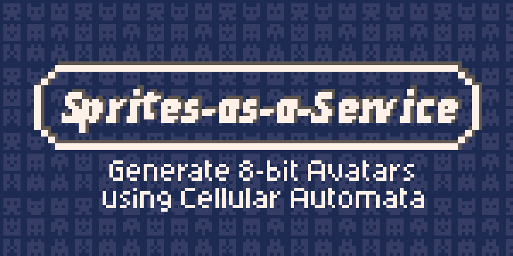

**Try the interactive demo [here](https://ljvmiranda921.github.io/sprites-as-a-service) :sparkles::sparkles:**

**Sprites-as-a-Service** is an open-source web application that allows you to
generate custom 8-bit sprites using Cellular Automata, particularly Conway's
Game of Life. Generate a unique sprite given a text, and control extinction and
survival rates. In addition, you can also access the generator via a REST API.
**Use it for your chat app or games!**

The frontend is made with Vue.js (with Nuxt.js) whereas the backend is done
using Python and FastAPI.

## Running the development server 

The easiest way to run Sprites-as-a-service locally is via [docker
compose](https://docs.docker.com/compose/). First, clone this repository:

```sh
git clone git@github.com:ljvmiranda921/sprites-as-a-service.git
```

then build the images:

```sh
cd sprites-as-a-service
docker-compose build
```

This will then build two images, `sprites-backend` and `sprites-frontend`, for
the backend and frontend services of the web app. You can then run them with
the command:

```sh
docker-compose -d up
```

You should be able to see the application running at
[localhost:8080](localhost:8080). Close these services using:

```sh
docker-compose down
```

## Production server and deployment

The frontend demo application is currently deployed in my website. I first
generate a static website using Nuxt's `npm run generate`, then serve it on
Github pages. To see the frontend deployment procedure, I encourage you to
check `.github/workflows/gh-pages.yml`.

On the other hand, the backend service is deployed in [Google Cloud
Run](https://cloud.google.com/run/). I first build the image found in
`./backend/Dockerfile` and deploy them to GCP. Check
`.github/workflows/cloud-run.yml` for more information.

I highly-encourage you to use the [Docker
images](https://github.com/ljvmiranda921/sprites-as-a-service/packages)
published in this repository. You might not need the frontend component itself,
but the backend can be deployed as a microservice. 

```sh
docker pull docker.pkg.github.com/ljvmiranda921/sprites-as-a-service/sprites-backend:latest
```


## License

The content of this project itself is licensed under the [Creative Commons
Attribution 4.0 license](https://creativecommons.org/licenses/by/4.0/deed.ast), and the underlying source code used to generate the
sprites and build the website is licensed under the [MIT license](https://github.com/ljvmiranda921/sprites-as-a-service/blob/master/LICENSE).
